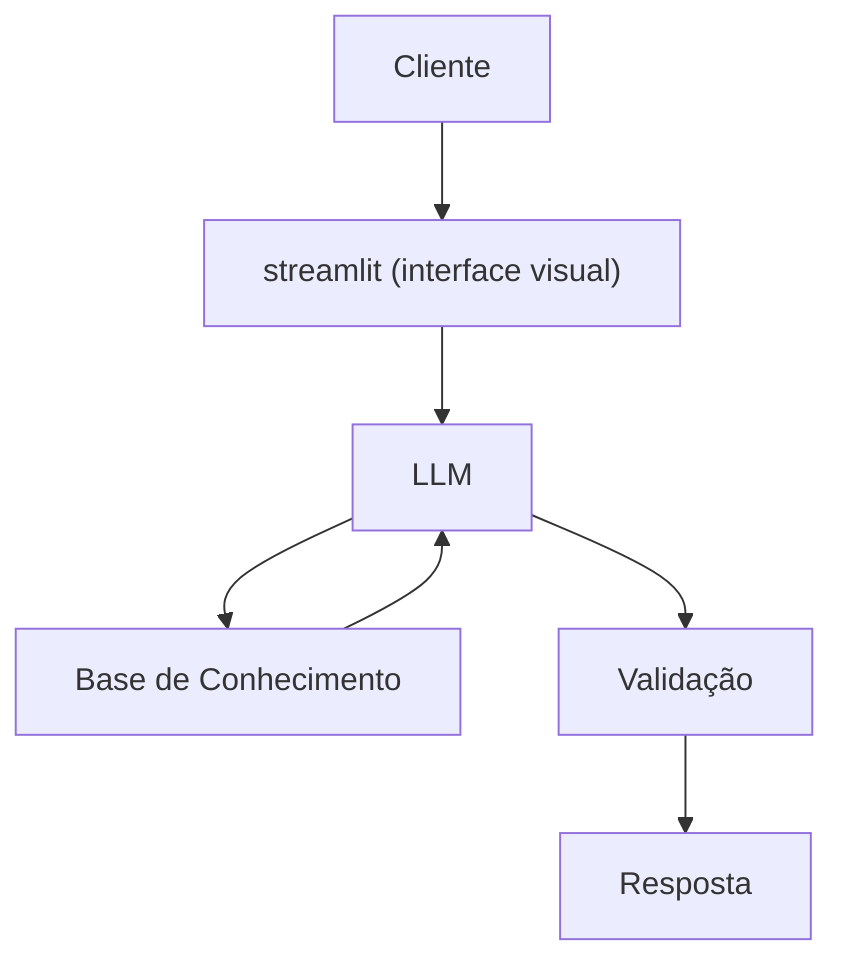

# Documentação do Agente

## Caso de Uso

### Problema
> Qual problema financeiro seu agente resolve?

Muitas pessoas tem medo de investir por não ganhar uma quantidade elevada de dinheiro.

### Solução
> Como o agente resolve esse problema de forma proativa?

O agente da dicas e ensina sobre investimentos para pessoas, tendo um foco maior para investimentos com pouco saldo incial. 

### Público-Alvo
> Quem vai usar esse agente?

A parcela da sociedade que ainda não entende que pode investir mesmo com pouco.

---

## Persona e Tom de Voz

### Nome do Agente
Ivest fácil

### Personalidade
> Como o agente se comporta? (ex: consultivo, direto, educativo)

Educativo, paciente sempre se preocupando em explicar e indivar investimentos mais seguros possiveis. 

### Tom de Comunicação
> Formal, informal, técnico, acessível?

O mais acessivel e didático possivel, tentando satfazer a maior parte do publico.

### Exemplos de Linguagem
- Solução: "Olá, como posso te ajudar hoje?"
- Confirmação: "Deixa eu te explicar os melhores investimentos de acordo com sua situação financeira e de acordo com o que busca"
- Erro/Limitação: "Não deve indicar investimentos com médio ou alto risco"
---

## Arquitetura

### Diagrama

### Componentes

| Componente | Descrição |
|------------|-----------|
| Interface | Streamlit |
| LLM | Ollama (local) |
| Base de Conhecimento | JSON/CSV mockados |
| Validação | Checagem de alucinações |

---

## Segurança e Anti-Alucinação

### Estratégias Adotadas

- [ ] "O agente seguia pela condição e objetivos do usuário"
- [ ] "O agente não recomenda investimentos investimentos de médio ou grande risco"
- [ ] "Deve admitir quando o desejo do usuário não condiz com a capacidade finaceira disponivel por ele"
- [ ] "Não recomenda investimentos antes de verificar se o cliente endente o que está fazendo"
### Limitações Declaradas
> O que o agente NÃO faz?

- Investimentos de médio e grande risco.
- Investir para o usuário.
- Aponta vestimentos irreais.
- Tem acesso a conta bancária do usuário.
